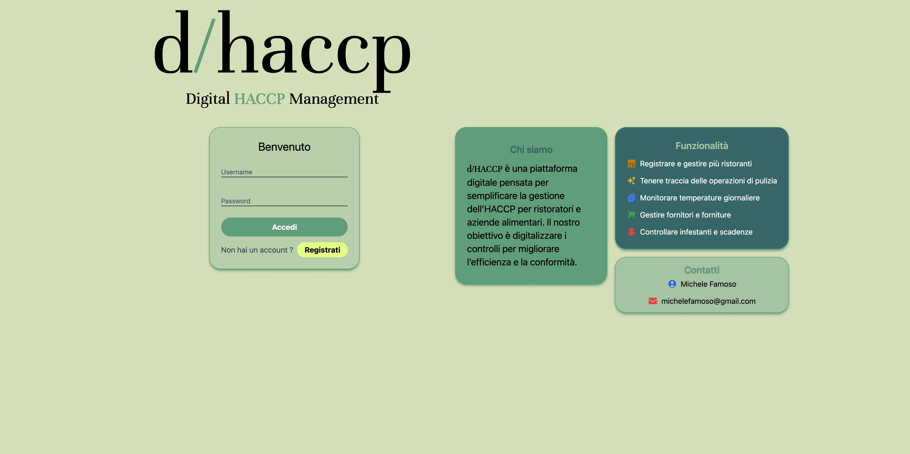
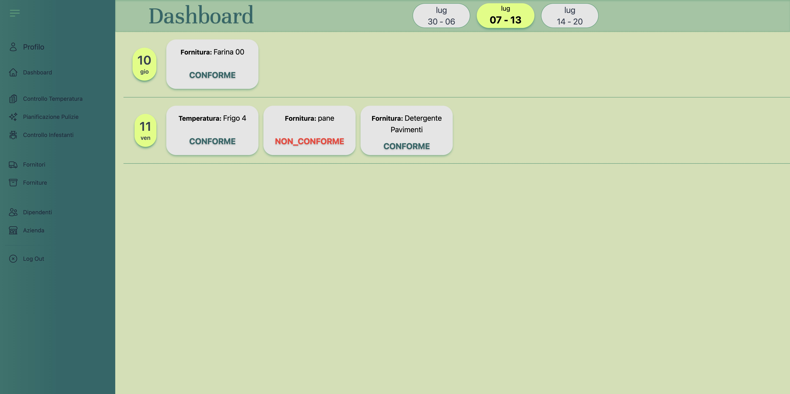
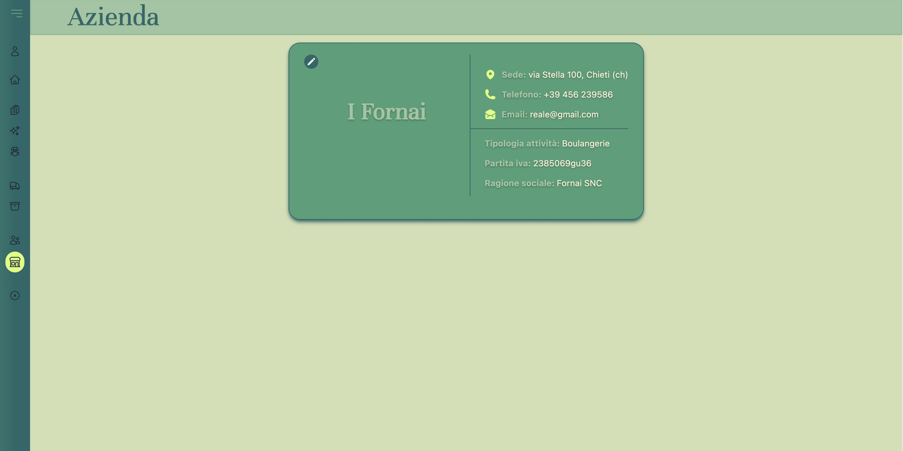
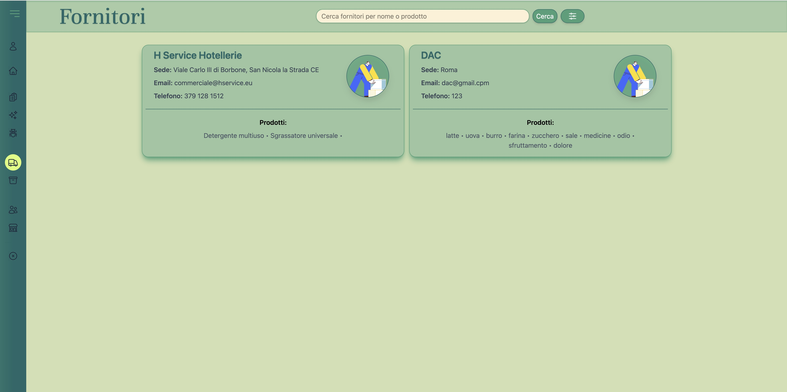
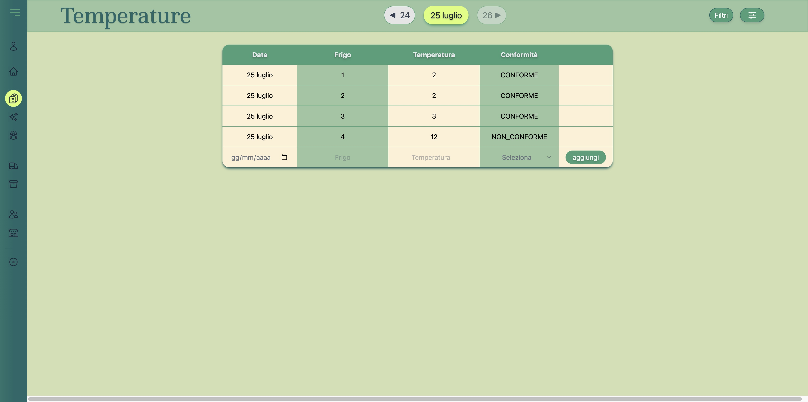
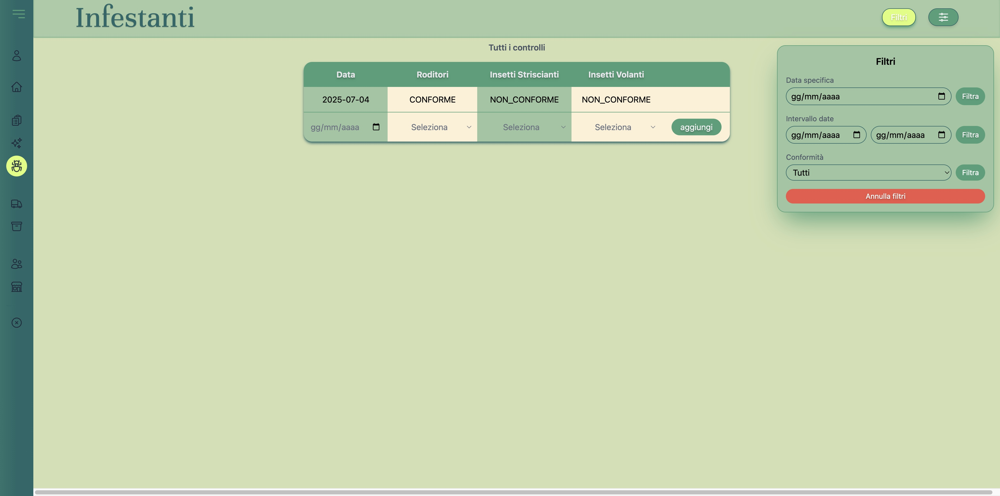

# d/HACCP - Frontend

**d/HACCP** è un'applicazione web pensata per semplificare la gestione dell'HACCP per ristoratori e aziende alimentari. Attraverso una dashboard intuitiva e responsive, permette di digitalizzare i controlli quotidiani richiesti dalle normative, migliorando efficienza e tracciabilità.

---

## 🖼️ Screenshot dell'app

### 🔐 Login



### 📊 Dashboard



### 📝 Azienda



### 📝 Fornitori



### 📝 Temperature



### 📝 Filtri



## 🚀 Funzionalità principali

- ✅ **Registrazione e login** degli utenti
- 🧼 **Tracciamento delle pulizie giornaliere**
- 🌡️ **Registrazione delle temperature dei frigoriferi**
- 📋 **Controllo infestanti e scadenze**
- 📦 **Gestione fornitori e forniture**
- 📱 **Interfaccia responsive**, ottimizzata per dispositivi mobili e desktop

---

## 🛠️ Tecnologie utilizzate

- **React.js** – Libreria principale per la costruzione dell’interfaccia utente
- **Tailwind CSS** – Framework utility-first per lo styling
- **React Router DOM** – Gestione delle rotte dell’applicazione
- **Heroicons** – Per la resa visiva delle funzionalità

---

## 🔗 Collegamento al backend

> Il progetto si appoggia a un backend Java SpringBoot . Puoi trovare il codice del backend qui:  
> 📎 **(https://github.com/MicheleFamoso/d-haccp)**

---

## 📦 Avvio locale

```bash
# Clona il repository
git clone https://github.com/MicheleFamoso/dhaccpFrontEnd

# Entra nella cartella
cd frontend-haccp

# Installa le dipendenze
npm install

# Avvia il progetto
npm run dev

📌 Note
L'app è pensata per funzionare in sinergia con un backend e un database.

Le API sono protette e l’autenticazione viene gestita lato backend.

👨‍💻 Autore
Michele Famoso
📧 michelefamoso@gmail.com

📃 Licenza
Questo progetto è rilasciato con licenza MIT. Sei libero di modificarlo, distribuirlo e usarlo anche per fini commerciali.
```
